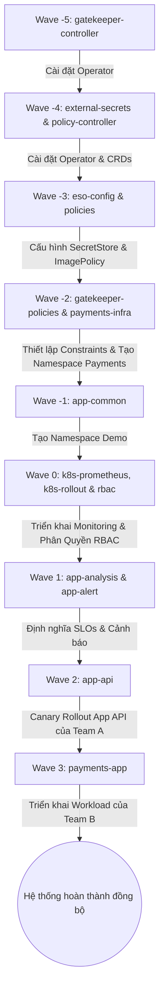

# Tổng Hợp Chi Tiết LAB1 & LAB2 - GitOps, Security & Operations

Tài liệu này tổng hợp chi tiết các file đã được thực hiện, sửa đổi trong **LAB 1** (RBAC & Admission Policy), **LAB 2** (Secrets Rotation & Supply Chain Security) và **Challenge** (Multi-Tenant Isolation), bao gồm tác dụng của từng file, dòng code cụ thể chứa tác dụng đó, và luồng thực thi (deployment/execution flow) tổng thể trên hệ thống Kubernetes GitOps.

---

## PHẦN 1: LAB 1 - RBAC & Admission Control (Gatekeeper)

LAB 1 tập trung thiết lập phân quyền người dùng và kiểm soát manifest khai báo tại cụm Kubernetes bằng OPA Gatekeeper nhằm ngăn chặn các hành vi cấu hình không an toàn.

### 1. Phân quyền người dùng (RBAC - Role-Based Access Control)

Các tài nguyên RBAC được khai báo tập trung để phân tách quyền lực rõ ràng cho 3 đối tượng người dùng: `alice` (Developer), `bob` (SRE), và `carol` (Viewer).

#### 1.1. [roles.yaml](file:///d:/xbrain/temp/rbac/roles.yaml)
* **Tác dụng:** Khai báo các quyền (Role và ClusterRole) cho từng nhóm vai trò trên cụm.
* **Chi tiết dòng code:**
  * **Dòng 6 - 17:** Định nghĩa `Role` `developer` giới hạn trong namespace `demo`, cho phép thực hiện toàn bộ thao tác CRUD (`get`, `list`, `watch`, `create`, `update`, `patch`, `delete`) trên pods, services (dòng 12-14) và deployments (dòng 15-17).
  * **Dòng 19 - 26:** Định nghĩa `ClusterRole` `sre` có phạm vi toàn cụm, cho phép thao tác và xem logs, exec vào pod (`pods`, `pods/log`, `pods/exec`) tại mọi namespace (dòng 24-26).
  * **Dòng 28 - 35:** Định nghĩa `ClusterRole` `viewer` có quyền chỉ đọc (`get`, `list`, `watch`) trên toàn bộ tài nguyên cụm (`resources: ["*"]` và `apiGroups: ["*"]` ở dòng 33-35).

#### 1.2. [rolebindings.yaml](file:///d:/xbrain/temp/rbac/rolebindings.yaml)
* **Tác dụng:** Liên kết (bind) các vai trò được định nghĩa trong `roles.yaml` với từng User tương ứng.
* **Chi tiết dòng code:**
  * **Dòng 1 - 13:** Liên kết `Role` `developer` với User `alice` trong namespace `demo`.
  * **Dòng 15 - 26:** Liên kết `ClusterRole` `sre` với User `bob` trên toàn cụm.
  * **Dòng 28 - 39:** Liên kết `ClusterRole` `viewer` với User `carol` trên toàn cụm.

#### 1.3. [rbac.yaml (ArgoCD App)](file:///d:/xbrain/temp/argocd/apps/rbac.yaml)
* **Tác dụng:** Ứng dụng ArgoCD quản lý đồng bộ GitOps cho thư mục RBAC.
* **Chi tiết dòng code:**
  * **Dòng 8:** Đặt mức độ ưu tiên deploy `sync-wave: "0"`.
  * **Dòng 13:** Định nghĩa đường dẫn trỏ tới thư mục cấu hình `path: rbac`.

---

### 2. Chính sách kiểm soát (Admission Policy - OPA Gatekeeper)

Các luật kiểm soát manifest tại Admission Webhook sử dụng OPA Gatekeeper. Mỗi chính sách bảo mật gồm 2 phần: `ConstraintTemplate` (chứa logic Rego) và `Constraint` (chứa tham số và phạm vi áp dụng).

#### 2.1. Cấm sử dụng Image Tag `:latest` (Risk F-01)
* **Template:** [k8sblocklatest.yaml](file:///d:/xbrain/temp/gatekeeper/templates/k8sblocklatest.yaml)
  * **Tác dụng:** Logic Rego phát hiện nếu image không chỉ định tag (dòng 37-39) hoặc kết thúc bằng `:latest` (dòng 40-42) của container thường, initContainer (dòng 24-35).
  * **Chi tiết dòng code:** Dòng 17-22 định nghĩa luật `violation` chặn image vi phạm.
* **Constraint:** [block-latest.yaml](file:///d:/xbrain/temp/gatekeeper/constraints/block-latest.yaml)
  * **Tác dụng:** Kích hoạt luật cấm tag `:latest` trên Pod, Deployment, Rollout ở mọi namespace ngoại trừ các namespace hệ thống.
  * **Chi tiết dòng code:** Dòng 8-15 chỉ định kiểu tài nguyên kiểm tra (`Pod`, `Deployment`, `Rollout`), dòng 16-20 loại trừ các namespace hệ thống (`kube-system`, `argocd`, `monitoring`, `gatekeeper-system`).

#### 2.2. Bắt buộc cấu hình Resource Limits (Risk F-02)
* **Template:** [k8srequiredresources.yaml](file:///d:/xbrain/temp/gatekeeper/templates/k8srequiredresources.yaml)
  * **Tác dụng:** Logic Rego phát hiện nếu container thiếu cấu hình `limits.cpu` hoặc `limits.memory`.
  * **Chi tiết dòng code:** Dòng 17-21 định nghĩa lỗi, dòng 30-38 kiểm tra xem có tồn tại `limits`, `limits.cpu`, và `limits.memory` hay không.
* **Constraint:** [required-limits.yaml](file:///d:/xbrain/temp/gatekeeper/constraints/required-limits.yaml)
  * **Tác dụng:** Áp dụng bắt buộc resource limits trên Pod, Deployment, Rollout.
  * **Chi tiết dòng code:** Dòng 8-15 chỉ định phạm vi target, dòng 16-20 cấu hình loại trừ các namespace hệ thống.

#### 2.3. Cấm chạy container dưới quyền Root (Risk F-04)
* **Template:** [k8sblockrootuser.yaml](file:///d:/xbrain/temp/gatekeeper/templates/k8sblockrootuser.yaml)
  * **Tác dụng:** Logic Rego phát hiện nếu `runAsUser` được đặt bằng `0` (Root) ở cấp độ Pod (dòng 17-21) hoặc cấp độ Container (dòng 23-27).
* **Constraint:** [block-root-user.yaml](file:///d:/xbrain/temp/gatekeeper/constraints/block-root-user.yaml)
  * **Tác dụng:** Áp dụng cấm root trên Pod, Deployment, Rollout trừ hệ thống.

#### 2.4. Cấm container sử dụng Host Network
* **Template:** [k8sblockhostnetwork.yaml](file:///d:/xbrain/temp/gatekeeper/templates/k8sblockhostnetwork.yaml)
  * **Tác dụng:** Logic Rego kiểm tra thuộc tính `hostNetwork: true`.
  * **Chi tiết dòng code:** Dòng 17-21 bắt lỗi nếu `hostNetwork == true`.
* **Constraint:** [block-host-network.yaml](file:///d:/xbrain/temp/gatekeeper/constraints/block-host-network.yaml)
  * **Tác dụng:** Cấm chia sẻ host network.

#### 2.5. Luật tự viết bổ sung: Giới hạn Deployment replicas tối đa là 5 (Lab 1.3)
* **Template:** [k8smaxreplicas.yaml](file:///d:/xbrain/temp/gatekeeper/templates/k8smaxreplicas.yaml)
  * **Tác dụng:** Logic Rego kiểm tra xem số lượng bản sao (`replicas`) của Deployment có vượt quá tham số cho phép hay không.
  * **Chi tiết dòng code:** Dòng 23-29 so sánh `replicas` với `maxReplicas` truyền vào và trả về thông báo lỗi.
* **Constraint:** [max-replicas.yaml](file:///d:/xbrain/temp/gatekeeper/constraints/max-replicas.yaml)
  * **Tác dụng:** Cấu hình giới hạn tối đa 5 replicas cho mọi Deployment trên các namespace ứng dụng.
  * **Chi tiết dòng code:** Dòng 17-18 truyền tham số `maxReplicas: 5`.

#### 2.6. Đồng bộ ArgoCD Apps cho Gatekeeper
* **[gatekeeper.yaml](file:///d:/xbrain/temp/argocd/apps/gatekeeper.yaml):** Trực tiếp cài đặt Helm Chart của Gatekeeper Operator lên namespace `gatekeeper-system` tại `sync-wave: "-5"` (dòng 8).
* **[gatekeeper-policies.yaml](file:///d:/xbrain/temp/argocd/apps/gatekeeper-policies.yaml):** Đồng bộ thư mục chứa các Template và Constraint lên cụm tại `sync-wave: "-2"` (dòng 8). Có kích hoạt thuộc tính đệ quy để quét các thư mục con `recurse: true` (dòng 15-16).

---

## PHẦN 2: LAB 2 - Secrets Rotation & Supply Chain Security

LAB 2 mở rộng khả năng bảo mật bằng cách tự động hóa xoay vòng secrets qua ESO (External Secrets Operator), quét mã độc/lỗ hổng CVE bằng Trivy, ký ảnh bằng Cosign, và chặn nạp ảnh chưa ký tại cụm.

### 1. Tự động hóa xoay vòng Secrets (ESO - External Secrets Operator)

#### 1.1. [secret-store.yaml](file:///d:/xbrain/temp/eso/secret-store.yaml)
* **Tác dụng:** Kết nối tới kho lưu trữ bí mật (ở đây giả lập `fake` provider phục vụ thử nghiệm để tránh hardcode thông tin kết nối lên Git).
* **Chi tiết dòng code:** Dòng 7-11 khai báo provider `fake` và lưu giá trị mật khẩu ban đầu là `initial-development-secret-password-123`.

#### 1.2. [external-secret.yaml](file:///d:/xbrain/temp/eso/external-secret.yaml)
* **Tác dụng:** Định nghĩa tài nguyên đồng bộ hóa dữ liệu từ SecretStore vào Kubernetes Secret thực tế và cấu hình khoảng thời gian kiểm tra thay đổi.
* **Chi tiết dòng code:**
  * **Dòng 7:** Đặt `refreshInterval: 10s` (kiểm tra và cập nhật mỗi 10 giây).
  * **Dòng 11-13:** Tạo ra một K8s Secret thực tế tên `db-secret`.
  * **Dòng 14-17:** Đồng bộ khóa dữ liệu `demo/db/password` vào K8s Secret dưới key `password`.

#### 1.3. [api/app.py (Flask API)](file:///d:/xbrain/temp/src/api/app.py)
* **Tác dụng:** Sửa đổi mã nguồn ứng dụng để đọc mật khẩu trực tiếp từ tệp được mount trong hệ thống file (Volume Mount) thay vì đọc biến môi trường tĩnh. Điều này giúp ứng dụng tự động nhận mật khẩu mới khi xoay vòng mà không cần khởi động lại Pod.
* **Chi tiết dòng code:** Dòng 19-25 bổ sung API endpoint `/secret` để đọc nội dung file `/secrets/password` khi được truy vấn.

#### 1.4. [rollout.yaml](file:///d:/xbrain/temp/app-api/rollout.yaml)
* **Tác dụng:** Cấu hình workload của app `api` để tương thích với bảo mật non-root và mount secret dạng file.
* **Chi tiết dòng code:**
  * **Dòng 22-25:** Thiết lập `securityContext` non-root (`runAsUser: 1000`) đảm bảo qua được lớp kiểm duyệt `block-root-user` của Gatekeeper.
  * **Dòng 38-41:** Bổ sung `volumeMounts` trỏ thư mục `/secrets` vào bên trong container.
  * **Dòng 56-59:** Khai báo `volumes` liên kết với K8s Secret `db-secret` do ESO quản lý.

#### 1.5. [eso.yaml](file:///d:/xbrain/temp/argocd/apps/eso.yaml) & [eso-config.yaml](file:///d:/xbrain/temp/argocd/apps/eso-config.yaml)
* **Tác dụng:** Tải ứng dụng toán tử ESO Operator lên namespace `external-secrets` tại `sync-wave: "-4"` và áp cấu hình sync tài nguyên bí mật tại `sync-wave: "-3"`.

---

### 2. Bảo mật chuỗi cung ứng (Trivy + Cosign + Sigstore)

#### 2.1. [.github/workflows/build-push.yml](file:///d:/xbrain/temp/.github/workflows/build-push.yml)
* **Tác dụng:** Tự động hóa Pipeline CI/CD thực hiện quét mã độc lỗ hổng CVE và ký xác nhận nguồn gốc ảnh trước khi phát hành.
* **Chi tiết dòng code:**
  * **Dòng 67 - 74:** Step **Trivy vulnerability scanner** quét ảnh docker cục bộ. Cấu hình `exit-code: '1'` và `severity: 'HIGH,CRITICAL'` sẽ lập tức dừng pipeline (CI đỏ) nếu phát hiện lỗ hổng nghiêm trọng.
  * **Dòng 84 - 88:** Step **Sign the published Docker image** sử dụng Cosign cùng Private Key (lưu trong GitHub Secret) để ký số lên ảnh đã push.
  * **Dòng 90 - 93:** Tự động sửa tệp `app-api/rollout.yaml` để cập nhật tag phiên bản mới và commit đẩy ngược lại Git.

#### 2.2. [cluster-image-policy.yaml](file:///d:/xbrain/temp/policies/cluster-image-policy.yaml)
* **Tác dụng:** Cấu hình chính sách Sigstore Policy Controller trên toàn cụm K8s, ép buộc mọi ảnh thuộc registry chỉ định phải được xác thực bằng chữ ký khớp với Public Key tương ứng.
* **Chi tiết dòng code:**
  * **Dòng 7:** Giới hạn phạm vi áp dụng cho toàn bộ ảnh từ `ghcr.io/dvquyet/**`.
  * **Dòng 9-14:** Nhập Public Key dùng để giải mã chữ ký xác thực.

#### 2.3. [policy-controller.yaml](file:///d:/xbrain/temp/argocd/apps/policy-controller.yaml) & [policies.yaml](file:///d:/xbrain/temp/argocd/apps/policies.yaml)
* **Tác dụng:** Cài đặt Sigstore Policy Controller lên cụm ở `sync-wave: "-4"` và đồng bộ các tài nguyên chính sách xác thực ảnh ở `sync-wave: "-3"`.

---

## PHẦN 3: BÀI TẬP LỚN - Onboarding Team Payments (Multi-Tenant Isolation)

Mục tiêu là tích hợp team mới `payments` vào cụm dùng chung nhưng hoàn toàn cô lập về quyền hạn và luồng mạng truyền thông (Network Policy), đồng thời kế thừa các luật kiểm soát admission của cụm một cách tự động.

### 1. [namespace.yaml](file:///d:/xbrain/temp/tenants/payments/namespace.yaml)
* **Tác dụng:** Khởi tạo namespace riêng biệt `payments` và kích hoạt chế độ xác thực chữ ký ảnh bằng cách gắn nhãn.
* **Chi tiết dòng code:** Dòng 6 cấu hình label `policy.sigstore.dev/include: "true"`. Mọi Pod triển khai tại đây sẽ tự động bị kiểm tra chữ ký ảnh.

### 2. [rbac.yaml](file:///d:/xbrain/temp/tenants/payments/rbac.yaml)
* **Tác dụng:** Cấp quyền least-privilege cho ServiceAccount `payments-dev` của team B, chặn đọc Secrets và thay đổi phân quyền.
* **Chi tiết dòng code:** Dòng 13-34 giới hạn phạm vi thao tác chỉ trên Pods, Deployments, Services, Jobs... Không khai báo tài nguyên `secrets` hay `rolebindings` trong mảng `resources`.

### 3. [quota.yaml](file:///d:/xbrain/temp/tenants/payments/quota.yaml)
* **Tác dụng:** Giới hạn ngân sách tài nguyên của namespace `payments` để tránh làm ảnh hưởng tới các tenant khác trên cụm.
* **Chi tiết dòng code:** Giới hạn tối đa 500m CPU request, 1CPU limit (dòng 8-10) và tối đa 10 Pods (dòng 12).

### 4. [limit-range.yaml](file:///d:/xbrain/temp/tenants/payments/limit-range.yaml)
* **Tác dụng:** Cung cấp cấu hình CPU/RAM mặc định cho các Pod trong namespace `payments` nếu lập trình viên quên không định nghĩa limits, tránh bị chặn bởi luật `required-limits`.
* **Chi tiết dòng code:** Tự động điền 200m CPU limit / 256Mi RAM limit (dòng 8-10).

### 5. [network-policy.yaml](file:///d:/xbrain/temp/tenants/payments/network-policy.yaml)
* **Tác dụng:** Cô lập giao tiếp mạng. Chặn toàn bộ luồng kết nối vào (Ingress) từ bên ngoài và chặn luồng đi ra (Egress) sang namespace khác (như `demo`), chỉ cho phép gọi nội bộ namespace và DNS.
* **Chi tiết dòng code:**
  * **Dòng 1 - 9:** Chính sách `default-deny-ingress` chặn đứng tất cả kết nối inbound.
  * **Dòng 11 - 34:** Chính sách `egress-isolation` chỉ cho phép outbound tới các pod cùng namespace (dòng 21-23) và tới dịch vụ DNS của cụm ở `kube-system` trên port 53 (dòng 24-33).

---

## PHẦN 4: LUỒNG THỰC THI (DEPLOYMENT & EXECUTION FLOW)

Hệ thống triển khai theo mô hình **GitOps App of Apps** (sử dụng tệp root [root.yaml](file:///d:/xbrain/temp/argocd/root.yaml)). Luồng triển khai được điều phối chặt chẽ thông qua cơ chế **Sync Waves** của ArgoCD theo thứ tự tuần tự từ nhỏ đến lớn:

### Chi tiết các bước trong luồng:

1. **Khởi tạo hạ tầng Core Operator (Waves -5 và -4):**
   * Đầu tiên, Gatekeeper controller được cài đặt để cung cấp hệ thống kiểm duyệt manifest.
   * Tiếp đó, External Secrets Operator (ESO) và Sigstore Policy Controller đồng thời được cài đặt để sẵn sàng nhận diện các CRDs dạng `SecretStore`, `ClusterImagePolicy`.
2. **Cấu hình chính sách an toàn (Waves -3 và -2):**
   * Triển khai `fake-store` (SecretStore) và cấu hình khóa xác thực ảnh của Cosign (`ClusterImagePolicy`).
   * Apply các chính sách kiểm duyệt `ConstraintTemplate` và `Constraint` của Gatekeeper để bảo vệ cụm trước khi bất kỳ workload nào được nạp vào.
   * Đồng thời tạo namespace `payments` cùng hạ tầng cô lập (RBAC, Quota, NetworkPolicy) của Team B.
3. **Cài đặt môi trường dùng chung & RBAC (Waves -1 và 0):**
   * Namespace `demo` được tạo lập.
   * Phân quyền cho Alice, Bob, Carol được nạp vào. Argo Rollout Controller và Prometheus stack bắt đầu hoạt động.
4. **Deploy Workload & Cấu hình Phân tích (Waves 1, 2 và 3):**
   * Argo Rollouts triển khai Canary Rollout ứng dụng `api`.
   * Sigstore xác thực chữ ký của ảnh `ghcr.io/dvquyet/w10-api` thành công nhờ Public Key đã khai báo.
   * ESO tự động tạo `db-secret` trong namespace `demo` bằng cách đồng bộ từ mock store sau mỗi 10 giây. Khi giá trị mật khẩu trên mock store thay đổi, ESO cập nhật vào K8s Secret, Volume Mount tự động cập nhật tệp mật khẩu bên trong Pod mà **không gây restart Pod** (AGE của Pod không đổi).
   * Ứng dụng `payments-app` được deploy tại Wave 3 vào namespace `payments`. Mọi nỗ lực truy cập tài nguyên chéo từ `payments` sang `demo` sẽ bị Network Policy chặn đứng.
